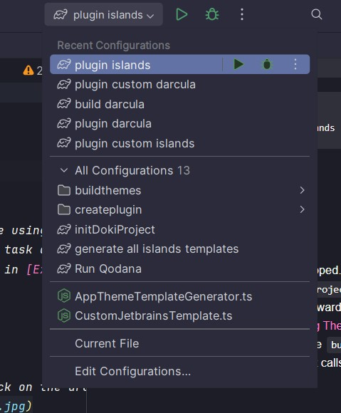

Development Setup
---

## Requirements

- Java 25+
- IntelliJ IDEA
- Plugin DevKit (IntelliJ bundled plugin)
- Typescript
- Node.js 24+
- yarn v4+

## Getting Dependencies

doki-theme-jetbrains utilizes Gradle to make automating tasks easier. The first thing we will need is to grab all the
other doki projects doki-theme-jetbrains depends on. To do this we will use a custom Gradle task called
`initDokiProject`.

```bash
./gradlew initDokiProject
```

`initDokiProject` essentially calls the `buildThemeDeps` task which in turn calls `getRepos` task.

### Initialization Tasks

Usually, these are tasks you will only need to run once.

- `initDokiProject`: calls all initialization tasks listed below.
  - `getRepos`: Retrieve projects from the doki theme ecosystem that doki-theme-jetbrains depends on
  - `buildThemeDeps`: build dependencies found in each doki subproject retrieved from `getRepo`

## Variant Templates

Templates provides instructions for mapping and building both `<doki-theme>.theme.json` & `<doki-theme>.xml` files which
IntelliJ uses to construct a doki theme.

A variant is the type of style that can be generated into a plugin. Right now these are the types that can be generated:

- `islands`
- `darcula`
- `custom-<variant>`. Ex: `custom-islands`

### Template Tasks

There are 2 tasks for generating templates:

- `genVariantBaseTemplates`: Generates a <variant> of all the base templates located at
  `doki-build-plugin/assets/templates`
- `genVariantTemplates`: Generates a <variant> template using the darcula template of each of the doki templates found
  at
  `doki-build-plugin/assets/themes`
  - Automatically calls `genVariantBaseTemplates` before executing itself

So, if we want to generate `darcula` template variants we do not have to do anything. All templates found in
`doki-build-plugin/assets/*` are `darcula` templates. **The tasks above are only used to generate new non-darcula
variants!**.

if we want to generate a non-darcula variant such as `islands`, we would need to tell Gradle what variant we want to
generate. To do this, we use the formula, `-Pvariant=<variant-name>`.

```bash
# This will execute `genVariantBaseTemplate`  and `genVariantTemplate`.
./gradlew genVariantTemplates -Pvariant=islands
```

### Extra: New Variant Templates

If you would like to add a new variant template, see [NEW_VARIANTS.md](./md_docs/NEW_VARIANTS.md)

## Building Themes

The next steps are:

- Build each doki theme using the templates
- Place each of the newly constructed doki themes in the doki-theme-jetbrain's resource folder:
  `src/main/resources/doki/themes/*`
- Map information about each doki theme including their name and location in `plugin.xml`
- Update the `name` and `id` key in plugin.xml to match the name of the current variant being made into a plugin.

Phew! That's a lot to do. Luckily, we can use a task called `buildThemes` to accomplish these tasks. We must specify
what variant we would like to build using the formula, `-Pvariant=<variant-name>`. `darcula`
is the default choice if `-P` option is not used.

```bash
# Example of building 'darcula' themes
./gradlew buildThemes
```

```bash
# Example of building non-dracula themes like 'islands'
./gradlew buildThemes -Pvariant=islands
```

These are examples of building custom doki variants. See [NEW_COLOR_THEME.md](./NEW_COLOR_THEME.md)

```bash
# Example of building custom darcula theme variants.
./gradlew buildThemes -Pvariant=custom-darcula
```

```bash
# Example of building custom islands theme variants.
./gradlew buildThemes -Pvariant=custom-islands
```

## Extra: Building a Plugin

Once everything above have been completed, we can now create a plugin! We will use **Intellij Platform's** `buildPlugin`
task. We must specify what variant we would like our plugin to build, using the formula, `-Pvariant=<variant-name>`.
`darcula` is the default choice if `-P` option is not used.

**NOTE:** `buildPlugin` calls `buildThemes` before executing. **This means you can _skip_ `buildThemes` task if you ever
decide to just run `buildPlugin`!**

```bash
# darcula example
./gradlew buildPlugin
```

```bash
# non-darcula example
./gradlew buildPlugin -Pvariant=islands
```

## Shortcuts

### CLI

Majority of the steps above could be skipped. If this is your first time using this project run `initDokiProject` task.
From here, all you would need to run going forward is the `buildThemes` task according
to [Building Themes](#building-themes). You can even skip `buildThemes` and instead use `buildPlugin` as stated
in [Extra: Building a plugin](#extra-building-a-plugin), since it calls `buildThemes` anyway...

### IntelliJ Run Configuration

Alternative to using CLI.

The project comes with preset `Run` configurations. To access them, click on the dropdown menu found in this image:
